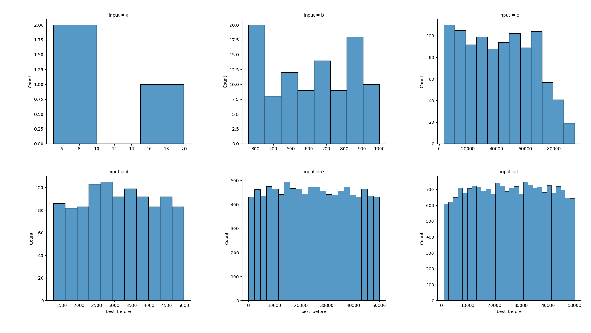
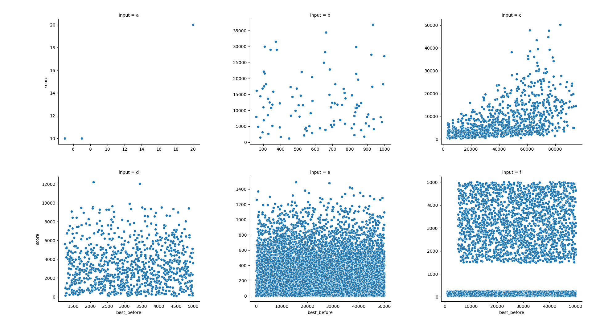
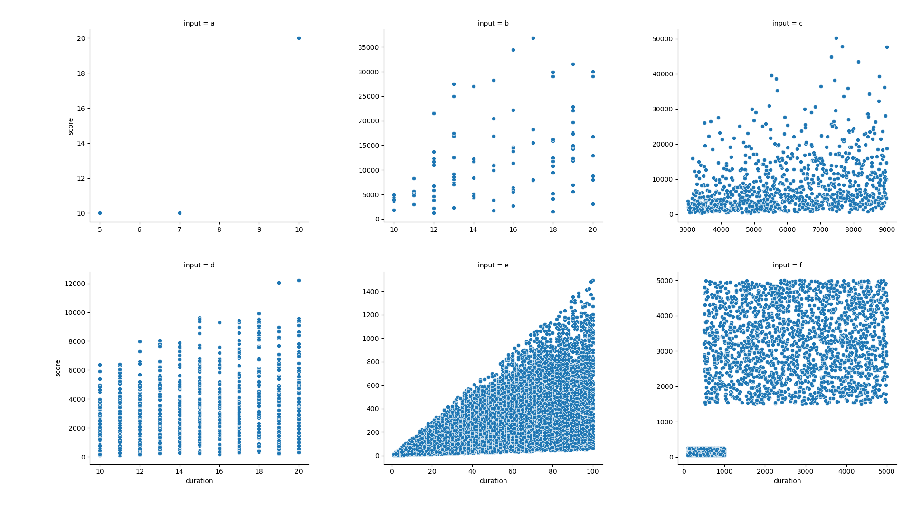
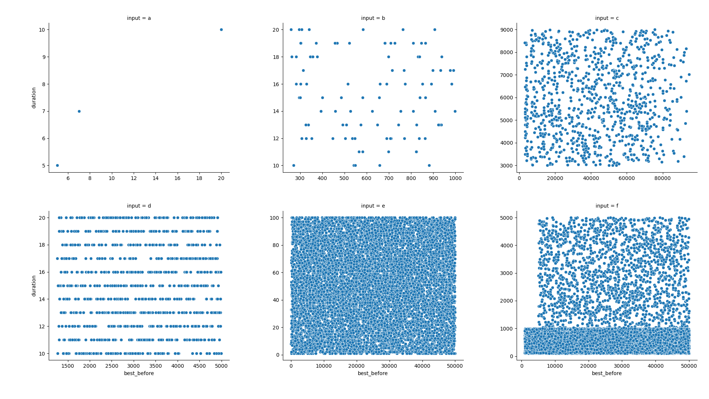

# hashcode

## Code

Command should be like

```bash
  python3 main.py < infile.txt
```

## Files

- All the code in the root dir
- A data directory for the instances
- pdf of the problem in the root dir

## Data "Mining"

### Decsriptors

C = Number of contributors
P = Number of projects
Ns = Unique number of skills for a given input
Ns_proj = number of skills per project
Ns_cont = number of skills per contributor

| data | C    | P     | Ns  | mean(Ns_proj)      | sd(Ns_proj)        | mean(Ns_cont)      | sd(Ns_cont)          |
| ---- | ---- | ----- | --- | ------------------ | ------------------ | ------------------ | -------------------- |
| a    | 3    | 3     | 4   | 1.6666666666666667 | 0.5773502691896257 | 1.3333333333333333 | 0.5773502691896257   |
| b    | 50   | 100   | 36  | 5.31               | 2.805820069538719  | 1                  | 0.0                  |
| c    | 1500 | 1000  | 200 | 39.315             | 11.652448436039293 | 2.9993333333333334 | 0.025819888974716113 |
| d    | 500  | 1000  | 188 | 12.868             | 7.096402957480285  | 1                  | 0.0                  |
| e    | 800  | 10000 | 800 | 7.6749             | 5.032985504082883  | 1                  | 0.0                  |
| f    | 1000 | 19413 | 500 | 24.764281666924226 | 9.70821301813859   | 2.56               | 1.26649279666487     |

### Visualizations

#### Distribution of Best Before



#### Score vs. Best Before



#### Score vs. Duration



#### Duration vs. Best before


